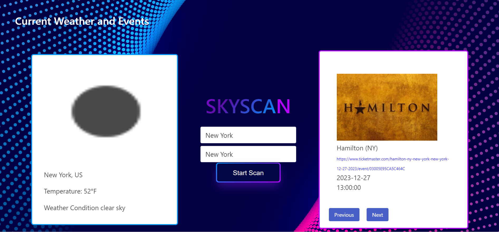
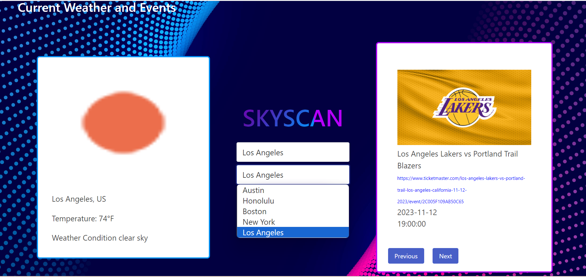

 # SkyScan

## Description

Everyone's been a victim of weather ruining their plans. Especially as someone who likes to do things spontaneously, I also realize that weather is a notable consideration when going out. So when I want to search for things to do in my city, i'll also be prompted the weather to decide how possible it'll be or what apparel i'll wear depending on the situation. By having the weather alongside potential events, it'll help you plan out your day. This was our first time implementing two API's and using one input value for both. Each API is different and so documentation and due diligence is important to master each API.

## Installation

Make sure you use your own API keys for Ticketmaster and OpenWeather API

## Usage

Provide instructions and examples for use. Include screenshots as needed.

To add a screenshot, create an `assets/images` folder in your repository and upload your screenshot to it. Then, using the relative file path, add it to your README using the following syntax:

Once loaded into the application, type in any US city and click the 'Start Scan' button

Results for the city should then show onto the page

Utilize the previous and next buttons on the events section to scroll through 19 options

Local storage demo 1

Local storage appends to list 

## Credits

This was a group project and my teammate was Pakapong Mongkol = https://github.com/Pak547/surprise-me-daily

## License

MIT License

Copyright (c) 2023 Pakapong Mongkol , Tasnim Halim

Permission is hereby granted, free of charge, to any person obtaining a copy
of this software and associated documentation files (the "Software"), to deal
in the Software without restriction, including without limitation the rights
to use, copy, modify, merge, publish, distribute, sublicense, and/or sell
copies of the Software, and to permit persons to whom the Software is
furnished to do so, subject to the following conditions:

The above copyright notice and this permission notice shall be included in all
copies or substantial portions of the Software.

THE SOFTWARE IS PROVIDED "AS IS", WITHOUT WARRANTY OF ANY KIND, EXPRESS OR
IMPLIED, INCLUDING BUT NOT LIMITED TO THE WARRANTIES OF MERCHANTABILITY,
FITNESS FOR A PARTICULAR PURPOSE AND NONINFRINGEMENT. IN NO EVENT SHALL THE
AUTHORS OR COPYRIGHT HOLDERS BE LIABLE FOR ANY CLAIM, DAMAGES OR OTHER
LIABILITY, WHETHER IN AN ACTION OF CONTRACT, TORT OR OTHERWISE, ARISING FROM,
OUT OF OR IN CONNECTION WITH THE SOFTWARE OR THE USE OR OTHER DEALINGS IN THE
SOFTWARE.

## Attributions
